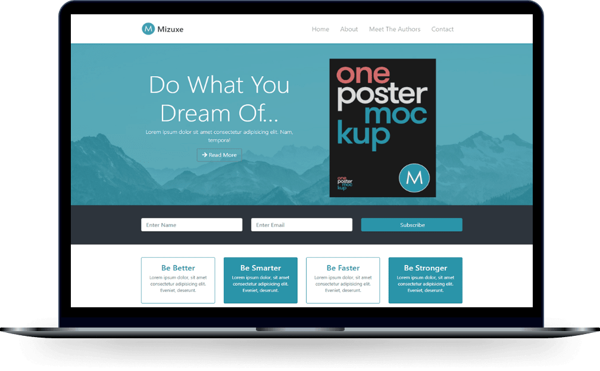
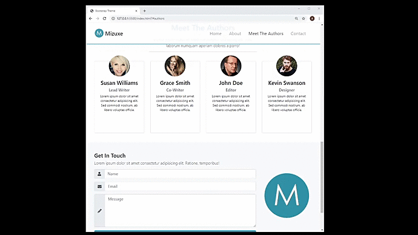

# Mizuxe - Book Theme
<p align="center">
  <a href="#-sobre">Sobre</a>&nbsp;&nbsp;&nbsp;|&nbsp;&nbsp;&nbsp;
  <a href="#-projeto">Projeto</a>&nbsp;&nbsp;&nbsp;|&nbsp;&nbsp;&nbsp;
  <a href="#-telas">Telas</a>&nbsp;&nbsp;&nbsp;|&nbsp;&nbsp;&nbsp;
  <a href="#-tecnologias">Tecnologias</a>&nbsp;&nbsp;&nbsp;|&nbsp;&nbsp;&nbsp;
  <p align="center">
 

  
</p>
</p>

<p align="center">
  
</p>

 <!-- Link para teste-->
 <h5 align="center">
    🎬 Clique Aqui: &nbsp; <a href="https://MizuxeBookTheme.vercel.app/">  Visualizar Demonstração </a> 
 </h5>

#
<!--
# Indice
- [Sobre](#-Sobre)
- [Tecnologias](#-Tecnologias)
- [Como Baixar o Projeto](#-Como-Baixar-o-Projeto)
-->
## 🔖 Sobre

  #####   Este projeto é modelo de aplicação onde desenvolvi uma **landing page**, basicamente o objetivo foi reproduzir um livro de auto ajuda descrito por alguns autores, a ideia foi criar um tema de pagina como o **Loop Lab**.

  #####   No layout é possível ver a criação de barras de navegação em ancora, e no top temos uma área de vitrine com uma sobreposição de cor e texto com imagem ao fundo junto a um **overlay** de pôster de **marketing**, abaixo uma pequena seção de Newsletter com um pequeno formulário em forma de linha, tendo alguns box card's e forms com área contatos.
  
  <br>

  ## 💻 Projeto
  
 #####   Todo o tema do projeto é responsivo constituindo de barras de navegação fixadas na parte superior incluindo recursos de eventos **Smooth Scrolling**,para uma rolagem suaves da pagina, aplicadas as funções de codificação em **Java Script**, e também recursos de acordeão usados na seção sobre.
 #####   Para telas menores, existe o botão de recolhimento que mostra os menus da barra de navegação, na sessão de Autores, contendo algumas imagens sobrepostas acima dos Card's, aplicados a **eventos .card:hover** ativações por seleção do mouse em movimento que criam a sobreposição de cores padrão da pagina.
 #####   A sessão de contatos e constituída por um formulário onde utilizo grupos de entrada contendo nos índices,ícones correspondentes o label de cada input text, ao logo na posição lateral um ícone de logo marca.
 #####   A estilização de cores padrões da paginas incluídas as sessões e eventos, utilizei um **pré-compilador** para a conversão para **CSSA - SAS**, que permitiu fazer coisas como usar variáveis onde é possível alinhar estilos, e mais importante é que é possível editar o **bootstrap**, basicamente editar o bootstrap do núcleo, ajustando cores fontes etc. Para isso, utilizei a ferramenta **Koala** **_http://koala-app.com/_**, que é um programa GUI, uma interface gráfica para compilar o **SAS**.

<br>

###### **Curso :**  Bootstrap 4 and learning HTML5 semantics & CSS3- [Udemy](https://Udemy.com.br)
###### **Instrutor :** Brad Traversy

<br>

## 💻 **Telas**


<div align="center">




</div>
<br>
<br>

## 📌 Instruções : 

Para iniciar o Servidor da aplicação utilizando o **VsCode** use o comando: **_Open Whit Live Server_** então acesse pelo navegador **_http://127.0.0.1:5500/index.html_** 

<br>

## 🚀 Tecnologias

- **HTML** - Front-End;
- **CSS3** - Front-End;
- **CSSA-SAS** - Front-End;
- **Java Script**
- **Bootstrap 4** (Template Engine) - Front-End
- **Koala** - [Dowload - Koala](http://koala-app.com/)

<br>


## 📁 Como Baixar o Projeto

```bash
  # Clonar o repósitorio
  $ git clone https://github.com/alxlima/MizuxeBookTheme.git
  
  # Entrar no diretório
  $ cd c:/Mizuxe

  # Instalar as dependências
  $ yarn install
  
  # Iniciar o Projeto
  $ yarn start
```
#
 Desenvolvido 🚀 por: ***_Alex Sandro da Silva lima_***